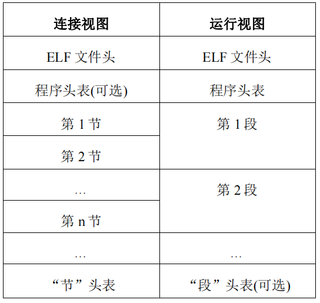

# Program_Linking_and_Loading（以elf文件为例）

参考#include <elf.h>，该文件在/usr/include/elf.h https://blog.csdn.net/parallelyk/article/details/42747239

## 目标文件（elf文件）简介
  
  
  - ELF(Executable and Linking Format)，即“可执行可连接格式”，最初由 UNIX系统实验室做为ABI的一部分而制定和发布，最大特点在于它有比较广泛的适用性，通用的二进制接口定义使之可以
    平滑地移植到多种不同的操作环境上。这样，不需要为每一种操作系统都定义一套不同的接口，因此减少了软件的重复编码与编译，加强了软件的可移植性。ELF 文件格式规范由 TIS(Tool Interfa
    ceStandards – 工具接口标准)委员会制定，TIS 委员会是一个微型计算机工业的联合组织，它致力于为 32 位操作系统下的开发工具提供标准化的软件接口。这种接口包括目标标志格式、可执行文
    件格式，以及调试信息的格式。
      
  - 目标文件/ELF 文件主要分为以下四种类型：
    
    + 可重定位文件(relocatable file)：用于与其它目标文件进行连接以构建可执行文件或动态链接库。之所以称其为“可重定位”，是因为在这些文件中，如果引用到其它目标文件或库文件中定义的
      符号（变量或者函数）的话，只是给出一个名字，这里还并不知道这个符号在哪里，其具体的地址是什么。需要在连接的过程中，把对这些外部符号的引用重新定位到其真正定义的位置上，所以称
      目标文件为“可重定位”或者“待重定位”的。示例：linux下的.o文件。
        
    + 共享目标文件(shared object file)：即动态连接库文件。它在以下两种情况下被使用：第一，在连接过程中与其它动态链接库或可重定位文件一起构建新的目标文件；第二，在可执行文件被加
      载的过程中，被动态链接到新的进程中，成为运行代码的一部分。示例：linux下的.so文件。
        
    + 可执行文件(executable file)：经过连接的，可以执行的程序文件。

    + 核心转储文件(core dump file)：进程意外终止，操作系统将该进程地址空间的内容及终止时的其他信息转储到核心转储文件。
  
  
  
## 目标文件的组成
  
  - 从连接的角度和运行的角度，可以分别把目标文件的组成部分做以下的划分：

    
    
    + ELF 文件头 (ELF header) :位于文件的最开始处，包含有整个文件的结构信息.
    
    + 程序头表 (program header table) 在运行过程中是必须的，在连接过程中是可选的，因为它的作用是告诉系统如何创建进程的镜像，是将相同属性的节合并在一起。

    + 节 (section) 专用于连接过程。.text节存储指令，.rdata存储只读数据，如字符串常量。.data存储已经初始化的全局变量和局部静态变量。.bss存储未初始化的全局变量和局部静态变量。
    
    + 节头表 (section header table) 包含有文件中所有“节”的信息。在连接视图中，“节头表”是必须存在的，文件里的每一个“节”都需要在“节头表”中有一个对应的注册项，这个注册项描述了节的
      名字、大小等等。在上图中，程序头表紧跟在 ELF 文件头之后，节头表紧跟在节信息之后，但在实际的文件中，这个顺序并不是固定的。在 ELF 文件的各个组成部分中，只有ELF 文件头的位置是
      固定的，其它内容的位置全都可变。
      
      
## 各结构细节（以SimpleSection.c文件为例）

  - elf文件头

       
  
      * 介绍：ELF 文件头(ELF header)位于目标文件最开始的位置，含有整个文件的一些基本信息。文件头中含有整个文件的结构信息，包括一些控制单元的大小。通过文件头可解析出elf文件全部内容。
        
      * 数据结构：
      
          typedef struct
          
          {
          
          unsigned char	e_ident[EI_NIDENT];	/* Magic number and other info */
          
          Elf64_Half	e_type;			/* Object file type */
          
          Elf64_Half	e_machine;		/* Architecture */
          
          Elf64_Word	e_version;		/* Object file version */
          
          Elf64_Addr	e_entry;		/* Entry point virtual address */
          
          Elf64_Off	e_phoff;		/* Program header table file offset */
          
          Elf64_Off	e_shoff;		/* Section header table file offset */
          
          Elf64_Word	e_flags;		/* Processor-specific flags */
          
          Elf64_Half	e_ehsize;		/* ELF header size in bytes */
          
          Elf64_Half	e_phentsize;		/* Program header table entry size */
          
          Elf64_Half	e_phnum;		/* Program header table entry count */
          
          Elf64_Half	e_shentsize;		/* Section header table entry size */
          
          Elf64_Half	e_shnum;		/* Section header table entry count */
          
          Elf64_Half	e_shstrndx;		/* Section header string table index */
          
          } Elf64_Ehdr;
      
      * 字段解析：
      
          + e_ident  16字节
          
          存储魔数及其他相关信息。最开始的4个字节是所有ELF文件都必须相同的标识码，分别为0x7F、0x45、0x4c、0x46，第一个字节对应ascii码的DEL控制符，而后三字节刚好是ELF三个字母
          的ascii码，几乎所有可执行文件开始都是魔数，一般这种魔数用于确定可执行文件类型，以确定下一步操作。如果魔数不正确，将会拒绝执行该文件。第五个字节是用来表示文件位数，0x00表
          示无效文件，0x01表示是32位的，0x02表示是64位的。第六位表示字节序，0x00表示无效格式，0x01表示小端，0x02表示大端。第七位表示elf文件版本，一般是1，表示1.2版本，elf自1.2版
          本后再也没有更新。最后9位保留，一般填0。
          
          + e_type    2字节
          
          此字段表名文件类型（不全）：
            - ET_NONE    0        未知文件类型
            - ET_REL     1        可重定位文件
            - ET_EXEC    2        可执行文件
            - ET_DYN     3        动态链接库文件
            - ET_CORE    4        core文件（目前不支持，但保留此关键字）
          
          + e_machine
          
          此字段表示处理器体系结构：
          
          + e_version
          
          此字段表名文件版本号，0表示非法版本号，1表示当前版本号，以后出现新版本，则1成为历史版本号。
          
          + e_entry
          
          此字段表示进程（程序）入口虚拟地址，实际地址取决于操作系统分配，对于可执行程序文件来说，当 ELF 文件完成加载之后，程序将从这里开始运行；而对于其它文件来说，这个值应该是 0。
          
          + e_phoff
          
          此字段表示程序头表(program header table)开始处在文件中的偏移量。如果没有程序头表，该值应设为 0。
          
          + e_shoff
          
          此字段指明节头表(section header table)开始处在文件中的偏移量。如果没有节头表，该值应设为 0。
          
          + e_flags
          
          此字段含有处理器特定的标志位。标志的名字符合”EF_machine_flag”的格式。对于 Intel 架构的处理器来说，它没有定义任何标志位，所以 e_flags 应该为0。
          
          + e_ehsize
          
          表示elf文件头，即此数据结构大小，单位字节。
          
          + e_phentsize 
          
          程序头表每一项的大小，单位字节。
          
          + e_phnum
          
          程序头表项数。
          
          + e_shentsize 
          
          节头表每一项大小，单位字节。
          
          + e_shnum
          
          节头表项数。
          
          + e_shstrndx
          
          节表字符串表表项的索引。如果没有，此值应设置为 SHN_UNDEF。
      
          
    - 节头表
    
        * 介绍：在目标文件中可以包含很多“节”(section)，所有这些“节”都登记在一张称为“节头表”(section header table)的数组里。节头表的每一个表项是一个 Elf32_Shdr结构，通过每一个表
                项可以定位到对应的节。些表项的索引值被保留，有特殊的含义。ELF 文件的节头表中不会出现索引值为以下各值的表项，具体见elf官方文档。通常，目标文件中含有众多的“节”，“节”
                是文件中最大的部分，它们需要满足下列这些条件:
            
                + 每一个节所占用的空间是连续的
                
                + 各个节之间不能互相重叠
                
                + 在目标文件中，节与节之间可能会存在一些多余的字节，这些字节不属于任何节，比如为对其而产生节与节之间的空隙。
            
                除了.text .data .bss这三个最常用的节之外，elf文件还包含其他节：
                
                + .comment 存放编译器版本信息
                + .debug 存放调试信息
                + .dynamic 动态链接信息
                + .dynstr 此节含有用于动态连接的字符串，一般是那些与符号表相关的名字。
                + .dynsym 此节含有动态连接符号表。
                + .interp 此节含有动态链接器的路径名。
                + .hash 符号哈希表
                + .strtab string table 字符串表
                + .symtab symbol table 符号表
                + .shstrtab 节表字符串表
                + .plt 动态链接跳转表
                + .got 动态链接全局入口表
                + .init 程序初始化代码段
                + .fini 程序终结代码段
                
        
        * 数据结构：
           
           typedef struct
           
           {
           
             Elf64_Word	sh_name;		/* Section name (string tbl index) */
             
             Elf64_Word	sh_type;		/* Section type */
             
             Elf64_Xword	sh_flags;		/* Section flags */
             
             Elf64_Addr	sh_addr;		/* Section virtual addr at execution */
             
             Elf64_Off	sh_offset;		/* Section file offset */
             
             Elf64_Xword	sh_size;		/* Section size in bytes */
             
             Elf64_Word	sh_link;		/* Link to another section */
             
             Elf64_Word	sh_info;		/* Additional section information */
             
             Elf64_Xword	sh_addralign;		/* Section alignment */
             
             Elf64_Xword	sh_entsize;		/* Entry size if section holds table */
             
           } Elf64_Shdr;
         
         * 字段解析：
            
            + sh_name          4字节
            
            本节的名字，整个名字的字符串并不存储在这里，它仅是一个索引号，指向“字符串表”节中的某个位置，那里存储了一个以’\0’结尾的字符串。
            
            + sh_type          4字节
            
            本节的类型（不全）:
                - SHT_NULL         0                   此值表明本节头是一个无效的（非活动的）节头，它也没有对应的节。本节头中的其它成员的值也都是没有意义的
                
                - SHT_PROGBITS     1                   此值表明本节所含有的信息是由程序定义的，本节内容的格式和含义都由程序来决定。代码段代码段都是这种类型
                
                - SHT_SYMTAB       2                   这两类节都含有符号表。目前，目标文件中最多只能各包含一个这两种节，但这种限制以后可能会取消。一般来说，SHT_SYMTAB 提供的
                                                       符号用于在创建目标文件的时候编辑连接，在运行期间也有可能会用于动态连接。SHT_SYMTAB 包含完整的符号表，它往往会包含很多在
                                                       运行期间(动态连接)用不到的符号。所以，一个目标文件可以再有一个 SHT_DYNSYM 节，它含有一个较小的符号表，专门用于动态连接
                                            
                - SHT_DYNSYM       11                  见上
                                                       
                - SHT_STRTAB       3                   此值表明本节是字符串表。目标文件中可以包含多个字符串表节
                
                - SHT_RELA         4                   此值表明本节是一个重定位节，含有带明确加数(addend)的重定位项，对于64位类型的目标文件来说，这个加数就是 Elf64_Rela。一
                                                       个目标文件可能含有多个重定位节
                
                - SHT_HASH         5                   此值表明本节包含一张哈希表。所有参与动态连接的目标文件都必须要包含一个符号哈希表。目前，一个目标文件中最多只能有一个哈
                                                       希表，但这一限制以后可能会取消。
                                                       
                - SHT_DYNAMIC      6                   此值表明本节包含的是动态连接信息。目前，一个目标文件中最多只能有一个 SHT_DYNAMIC 节，但这一限制以后可能会取消
                
                - SHT_NOTE         7                   此值表明本节包含的信息用于以某种方式来标记本文件
                                                       
                - SHT_REL          9                   此值表明本节是一个重定位节，含有带明确加数(addend)的重定位项，对于64位类型的目标文件来说，这个加数就是 Elf64_Rela。一
                                                       个目标文件可能含有多个重定位节
                
            - sh_flags         8字节
            
            本节的一些属性（不全，下文所有属性未说明则都不全）：
               + SHF_WRITE       0x1           本节所包含的内容在进程运行过程中是可写的
               + SHF_ALLOC       0x2           本节内容在进程运行过程中要占用内存单元。并不是所有节都会占用实际的内存，有一些起控制作用的节，在目标文件映射到进程空间时，并不需要
                                               占用内存
               + SHF_EXECINSTR   0x4           表示可执行，一般是代码段
               
            - sh_addr          8字节

            此成员指定映射的起始地址；如果不需要映射，此值为 0
            
            - sh_offset        8字节
            
            指明了本节所在的位置，该值是节的第一个字节在文件中的位置，即相对于文件开头的偏移量。单位是字节。如果该节的类型为 SHT_NOBITS 的话，表明这一节的内容是空的，节并不占用实
            际的空间，这时 sh_offset 只代表一个逻辑上的位置概念，并不代表实际的内容
            
            - sh_size          8字节
            
            指明节的大小，单位是字节。如果该节的类型为 SHT_NOBITS，此值仍然可能为非零，但没有实际的意义
            
            - sh_link          4字节

            与链接相关的段才有意义
            
            - sh_info          4字节
            
            与链接相关的段才有意义：
            
                sh_type           sh_link                                           sh_info 
                SHT_DYNAMIC       用于本节中项目的字符串表在节头表中相应的索引值        0 
                SHT_HASH          用于本节中哈希表的符号表在节头表中相应的索引值        0 
                SHT_REL/SHT_RELA  相应符号表在节头表中的索引值，                      本重定位节所应用到目标节在节头表中的索引值
                
                
            - sh_addralign     8字节
            
            此成员指明本节内容如何对齐字节，即该节的地址应该向多少个字节对齐。目前，sh_addralign 只能取 0、1或者 2 的正整数倍。如果该值为 0 或 1，表明本节没有字节对齐约束
            
            - sh_entsize       8字节
            
            有一些节的内容是一张表，其中每一个表项的大小是固定的，比如符号表。对于这种表来说，本成员指定其每一个表项的大小。如果此值为 0 则表明本节内容不是这种表格
                

    下面是特殊节的内容：

         
    - 字符串表

        * 介绍：
          - 本节描述默认字符串表。字符串表中包含有若干个以’null’结尾的字符序列，即字符串。在目标文件中，这些字符串通常是符号的名字或者节的名字。在目标文件的其它部分中，当需要引
            用某个字符串时，只需要提供该字符串在字符串表中的序号即可。字符串表中的第一个字符串（序号为 0）永远是空串，即”null”，它可以用于表示一个空的名字或者没有名字。所以，字
            符串表的第一个字节是’null’。由于每一个字符串都是以’null’结尾，所以字符串表的最后一个字节也必然为’null’。字符串表也可以是空的，不含有任何字符串，这时，节头中的 sh_size               成员必须是 0。一个目标文件中可能有多个字符串表，其中一个称为“节名字表(.shstrtab)”，它包含所有节的名字。每一个节头的 sh_name 成员应该是一个索引值，它指向节名字表中的
            一个位置，从这个位置开始到接下来第一个’null’字符为止的这个字符串，正是这个节的名字。既可以引用一个完整定义的字符串，即出现在两个’null’字符之间的整个串，也可以引用
            它的一部分。由于需要以’null’结尾，所以当引用一个子字符串时，一定是引用长串中靠后的那部分。
            
    - 符号表
        
        * 介绍
          - 链接的本质就是将各个不同的目标文件“粘”在一起。在链接中目标文件之间相互拼合实际上就是目标文件之间对地址的引用。符号是指函数或者变量。我们可以把符号看成链接中的粘合剂。而
            符号表的作用就是对所有符号进行管理。这里面记录了目标文件中所有用到的符号。每个定义的符号有一个对应的值叫做符号值，一般对于变量和函数来说这个符号值就是它们的地址。
          
        * 数据结构：
          typedef struct
          
          {
          
            Elf64_Word	st_name;		/* Symbol name (string tbl index) */
            
            unsigned char	st_info;		/* Symbol type and binding */
            
            unsigned char st_other;		/* Symbol visibility */
            
            Elf64_Section	st_shndx;		/* Section index */
            
            Elf64_Addr	st_value;		/* Symbol value */
            
            Elf64_Xword	st_size;		/* Symbol size */
            
          } Elf64_Sym;
          
         * 字段解析：
           
           + st_name

           符号的名字。但它并不是一个字符串，而是一个指向字符串表的索引值，在字符串表中对应位置上的字符串就是该符号名字的实际文本。如果此值为非 0，它代表符号名在字符串表中的索引值。            如果此值为 0，那么此符号无名字。
           
           + st_info
           
           符号的类型和属性。st_info 由一系列的比特位构成，高28位表示“符号绑定(symbol binding)”、低4位表示“符号类型(symbol type)”。
           
             - 符号绑定：STB_LOCAL 0 局部符号 对于目标文件外部不可见； STB_GLOBAL1 全局符号 外部可见；STB_WEAK 2 弱引用
             
             - 符号类型：
                + STT_NOTYPE 0 未知类型符号
                + STT_OBJECT 1 该符号是个数据对象
                + STT_FUNC 2 该符号是个函数或者可执行代码
                + STT_SECTION 3 该符号是一个段，这种符号必须是STB_LOCAL
                + STT_FILE 4 该符号表示文件名，这种符号必须是STB_LOCAL，并且st_shndx必须是SHN_ABS
             
           
           + st_other
           
           本数据成员目前暂未使用，在目标文件中一律赋值为 0。
           
           + st_shndx
           
           任何一个符号表项的定义都与某一个“节”相联系，因为符号是为节而定义，在节中被引用。本数据成员即指明了相关联的节。本数据成员是一个索引值，它指向相关联的节在节头表中的索引。在            重定位过程中，节的位置会改变，本数据成员的值也随之改变，继续指向节的新位置。当本数据成员指向下面三种特殊的节索引值时，本符号具有如下特别的意义：
           
              SHN_ABS 0xfff1
              符号的值是绝对的，具有常量性，在重定位过程中，此值不需要改变。
              
              SHN_COMMON 0xfff2
              表示该符号是COMMON块类型的符号。未初始化的全全局符号定义就是这种类型
              
              SHN_UNDEF  0
              表示此符号在本目标文件被引用到，但是定义在其他目标文件
              
           + st_value
           
           符号相对于的值，若不是common类型的，则表示该符号在节中的偏移，即在st_shndx指定的节中偏移量为st_value处。若是common类型的，则表示该符号对齐属性。而在可执行文件中，表示
           符号的虚拟地址
           
           + st_size
           
           符号的大小。各种符号的大小各不相同，比如一个对象的大小就是它实际占用的字节数。如果一个符号的大小为 0 或者大小未知，则这个值为 0。
       
       
     
            
    
    
## 静态链接（以a.o和b.o作为例子）

    关键数据结构：
    
    - 重定位表：
     
       * 介绍：对于可重定位的elf文件中必须包含重定位表，而对于每个需要重定位的节来说，都有对应的重定位表，用来描述如何修改该节中的内容。比如对于.text节来说，若需要重定位，则会有
               .rel.text的节保存.text节的重定位表。每个要被重定位的地方称为重定位入口。一个“重定位节(relocation section)”需要引用另外两个节：一个是符号表节，一个是被修改节。
               在符号表节，节头的 sh_info 和 sh_link 成员分别指明了引用关系。
            

       * 数据结构
       
         typedef struct
         
         {
         
         Elf64_Addr	r_offset;		/* Address */
         
         Elf64_Xword	r_info;			/* Relocation type and symbol index */
         
         } Elf64_Rel;
       
       * 字段解析
         
         + r_offset
         
         重定位入口的偏移。对于可重定位文件来说，这个值是这个值是该重定位入口所要修正的位置的第一个字节相对于段起始的偏移；对于可执行文件或者共享对象文件来说，这个值是该重定位入口
         所要修正的位置的第一个字节的虚拟地址。
         
         + r_info
           
         重定位入口的类型与符号。低8位表示重定位入口的类型，高24位表示重定位入口的符号在符号表中的下标。对于可执行文件或者共享目标文件，它们的重定位入口是动态链接类型的
         
         
         

    链接的本质就是将各个不同的目标文件“粘”在一起。在链接中目标文件之间相互拼合实际上就是目标文件之间对地址的引用。符号是指函数或者变量。我们可以把符号看成链接中的粘合剂。而符号表的
    作用就是对所有符号进行管理。这里面记录了目标文件中所有用到的符号。每个定义的符号有一个对应的值叫做符号值，一般对于变量和函数来说这个符号值就是它们的地址。
    
    现代的链接器一般采取两步链接：
    
    第一步：扫描所有输入目标文件，获取各个节长度、属性和位置。并且将输入目标文件的符号表中所有的符号定义和符号引用收集起来。统一放到全局符号表中。这一步，链接器将能够获取的所有输入目
    标文件的节长度，并且将相似节合并。计算输出目标文件中各个节合并后的长度与位置，并建立映射关系。
    
    第二步：符号解析与重定位：使用上面第一步搜集到的信息，读取输入文件中节的数据、重定位信息，并且进行符号解析与重定位、调整代码中的地址。第二部就是链接过程的核心。符号解析主要是将每
    一个引用和可重定位文件的符号表做一个定义上的关联，这是通过重定位表来达到。而重定位的作用是合并输入模块，并给每一个符号生成地址。
    
    
    以a.o和b.o作为例子分析。第一步扫描和空间分配，此时输入文件中的各个段在链接后的虚拟地址被确定。然后开始计算各个符号的虚拟地址，因为各个符号在段内的相对位置是固定的，所以“main”
    、“shared”和“swap”的地址已经被确定了。只不过链接器需要给每个符号加上一个偏移量，使他们能够调整到正确的虚拟地址。假设a.o中main函数相对text节开始的地址偏移是x，链接后a.o中text
    节位于虚拟地址0x08048094，那mian函数的地址就是x+0x08048094。其他符号地址计算过程类似。
    
    第二部就是符号解析与重定位，静态链接的核心！编译器把真正的地址计算工作留给了链接器，我们知道第一步链接器已经知道所有符号的虚拟地址了，那么链接器就可以通过此来对需要重定位的指令进
    行修正。。那么链接器是如何知道哪些指令的哪些部位需要被调整呢？怎么去调整呢？这就要用到重定位表了。所有需要重定位的地方都存在重定位表中，通过查找此表可知道所有需要重定位的地方。
    此时链接器需要对某个符号进行重定位时，它需要确定符号的目标地址啊，此时的全局符号表已经有目标地址了，所以通过r_info的高24位在全局符号表中查询，找到相应符号后通过r_info的低8位S、
    要被修正的值A和要被修正的位置P来计算出修正后的结果。
    
    
    
    
    
## 装载    
      
    关键数据结构：  
          
    - 程序头表

        * 介绍：

          - 一个可执行文件或共享目标文件的程序头表(program header table)是一个数组，数组中的每一个元素称为“程序头(program header)”，每一个程序头描述了一个“段(segment)”或者一
            块用于准备执行程序的信息。一个目标文件中的“段(segment)”包含一个或者多个“节(section)”。程序头只对可执行文件或共享目标文件有意义，对于其它类型的目标文件，该信息可以
            忽略。在目标文件的文件头(elf header)中，e_phentsize 和 e_phnum 成员指定了程序头的大小。
    
        * 数据结构：
          typedef struct
          
          {
          
            Elf64_Word	p_type;			/* Segment type */
            
            Elf64_Word	p_flags;		/* Segment flags */
            
            Elf64_Off	p_offset;		/* Segment file offset */
            
            Elf64_Addr	p_vaddr;		/* Segment virtual address */
            
            Elf64_Addr	p_paddr;		/* Segment physical address */
            
            Elf64_Xword	p_filesz;		/* Segment size in file */
            
            Elf64_Xword	p_memsz;		/* Segment size in memory */
            
            Elf64_Xword	p_align;		/* Segment alignment */
            
          } Elf64_Phdr;
          
          
        * 字段解析：
        
          + p_type    4字节
          
          说明程序头所描述段的类型，除非有特别要求，否则所有程序头的段类型域 p_type 都是可选项，不是必须存在的。在所有程序头都不指定段类型的情况下，程序头表中所有的表项都不代表
          任何特别的类型，而只是作为一种索引，表明其相应的段的大小和位置。
          
              - PT_NULL      0             此类型表明本程序头是未使用的，本程序头内的其它成员值均无意义。
              
              - PT_LOAD      1             此类型表明本程序头指向一个可装载的段。段的内容会被从文件中拷贝到内存中。如前所述，段在文件中的大小是 p_filesz，在内存中的大小是                                                    p_memsz。如果 p_memsz 大于 p_filesz，在内存中多出的存储空间应填 0 补充，也就是说，段在内存中可以比在文件中占用空间更大；而相反，                                                p_filesz永远不应该比 p_memsz 大，因为这样的话，内存中就将无法完整地映射段的内容。在程序头表中，所有 PT_LOAD 类型的程序头按照 
                                           p_vaddr 的值做升序排列。
                                           
              - PT_DYNAMIC   2             此类型表明本段指明了动态连接的信息。
              - 
              - PT_INTERP    3             本段指向了一个以”null”结尾的字符串，这个字符串是一个 ELF 解析器的路径。这种段类型只对可执行程序有意义，当它出现在共享目标文件中时，是
                                           一个无意义的多余项。在一个 ELF 文件中它最多只能出现一次，而且必须出现在其它可装载段的表项之前。
                                           
              - PT_NOTE      4             本段指向了一个以”null”结尾的字符串，这个字符串包含一些附加的信息。
              - 
              - PT_SHLIB     5             该段类型是保留的，而且未定义语法。UNIX System V 系统上的应用程序不会包含这种表项。
              - 
              - PT_PHDR      6             此类型的程序头如果存在的话，它表明的是其自身所在的程序头表在文件或内存中的位置和大小。这样的段在文件中可以不存在，只有当所在程序
                                           头表所覆盖的段只是整个程序的一部分时，才会出现一次这种表项，而且这种表项一定出现在其它可装载段的表项之前。
                                           
              - PT_LOPROC    0x70000000    类型值在这个区间的程序头是为特定处理器保留的。
              - 
              - PT_HIPROC    0x7fffffff    类型值在这个区间的程序头是为特定处理器保留的。

          
          + p_flags    4字节
          
          此数据成员给出了本段内容的属性。

          + p_offset   8字节
          
          此数据成员给出本段内容在文件中的位置，即段内容的开始位置相对于文件开头的偏移量。
          
          + p_vaddr    8字节

          此数据成员给出本段内容的开始位置在进程空间中的虚拟地址。
          
          + p_paddr    8字节
          
          没点卵用
          
          + p_filesz   8字节

          给出本段内容在文件中的大小，单位是字节，可以是 0。
          
          + p_memsz
          
          本段内容在内容镜像中的大小，单位是字节，可以是 0。
          
          + p_align
          
          对于可装载的段来说，其 p_vaddr 和 p_offset 的值至少要向内存页面大小对齐。此数据成员指明本段内容如何在内存和文件中对齐。如果该值为 0 或 1，表明没有对齐要求；否则，
          p_align 应该是一个正整数，并且是 2 的幂次数。p_vaddr 和p_offset 在对 p_align 取模后应该相等。
          
          

          
## 动态链接

    和静态链接的区别：动态链接也是解析符号引用的过程，和静态链接的区别时后者是发生在装载之前，而前者发生在装载后（进程初始化和进程运行期间）
    
    关键数据结构：
    
    - .interp段
      * 介绍：存储动态链接器路径
      
    - .dymsym段
      * 介绍：动态符号表，只保存与动态链接相关的符号表，而符号表什么都保存，与静态链接符号表结构一模一样
      
    - .dynstr段
      * 动态符号字符串表
    
    - .hash
      * 介绍：符号哈希表，加快符号查找
      
    - .rel.dyn
      * 动态链接重定位表，相当于rel.text
    
    - .rel.plt
      * 动态链接重定位表相当于.rel.data
    
    - .dynamic段
    
      * 介绍：是动态链接的核心段，保存了动态链接的基本信息，比如依赖哪些共享对象，动态链接符号表的位置、动态链接重定位表的位置、共享对象初始化代码段的地址等。可以看成动态链接下的elf
        文件头
      
      * 数据结构：
        typedef struct
        
       {
       
         Elf64_Sxword	d_tag;			/* Dynamic entry type */
         
         union
         
         {
         
           Elf64_Xword d_val;		/* Integer value */
           
           Elf64_Addr d_ptr;			/* Address value */
           
         } d_un;
         
       } Elf64_Dyn;
       
       * 字段解析：
       
       DT_SYMTAB  动态链接符号表地址 d_ptr表示其地址
       DT_STRTAB  动态链接字符串表地址 d_ptr表示其地址
       DT_STRSZ  动态链接字符串表大小 d_val表示其地址
       DT_HASH  动态链接哈希表地址 d_ptr表示其地址
       DT_INIT  初始化代码地址
       DT_FINIT  结束代码地址
       DT_NEED  依赖的共享对象文件，d_ptr表示文件名
       DT_REL  动态链接重定位表地址
       DT_RELENT  动态链接重定位表入口数量
    
    
    为什么要使用动态链接：节省内存；方便程序开发与发布
    
    如何解决动态链接绝对地址的引用？
    
    动态链接链接器也会参与，执行和静态链接一模一样的功能，绝对引用是定义在其他静态目标模块中的函数，那么链接器将按照静态链接的规则重定位，而如果是定义在动态共享对象中的函数，那么将其
    标记为动态链接的符号，不对其进行重定位，把这个过程留到装载或者运行时进行。
    
    装载时重定位：装载时重定位由动态链接器完成。共享对象的最终装载地址在编译时是不确定的，而是在装载时，装载器根据当前地址空间的空闲情况，动态分配一块足够大小的虚拟地址空间给相应的共
    享对象。一旦共享对象装载地址确定，此时可以遍历重定位表，将对此地址的引用重定位。这种情况可叫做装载时重定位。但是此方法的缺点是不能共享指令，共享对象也就是动态链接库在被装载到物理
    内存后，始终是只有一份的，不管有多少个进程使用它。但是对于每一个进程，共享对象会映射一次到虚拟地址空间，也就是每个进程空间都有一份共享对象的映射，此时，对于不同的进程，映射的地址
    （基址）是不一样的（大部分情况下）。紧接着，进行装载时重定位。动态链接器会被一起映射到进程空间中。它根据共享对象在虚拟内存空间中的地址修改在物理内存中的共享对象中的指令，为什么会
    修改指令，原因在于绝对地址访问（如模块内的变量访问）是直接用mov指令完成的，也就是直接将地址打入寄存器，所以，此时的重定位会直接修改指令。进一步，共享对象中修改的指令是根据共享对象
    被映射到虚拟空间中的地址（基址）决定的，而每个进程对共享对象的映射不可能都是在相同地址。所以也就无法完成这一部分代码的共享。
    
    
    地址无关代码：我们的目的就是共享的指令部分在装载时不会随着装载地址的变化而发生变化。实现的基本想法就是把需要修改的指令部分拿出来放到数据部分。对于共享对象中的可修改数据部分来说使
    用装载时重定位则没有问题，因为这部分会被每个进程都拷贝一份副本。四种类型实现地址无关代码：
    
      - 模块内部调用、跳转：使用相对位移
      
      - 模块内部数据访问：使用相对位移
      
      - 模块间调用、跳转：使用.got。链接器会在装载时查找每个变量所在的地址，将其填充入got表
      
      - 模块间数据访问：使用.got.plt
      
    对于数据段的地址无关性，我们还是使用装载时重定位。通过查找重定位表来重定位。
    
    
    延迟绑定：当函数第一次被调用时才进行符号查找与重定位。为了实现延迟绑定，又加了一层间接跳转代码，通常相关代码存放在.plt中，通过.plt跳转到.got中。如果是第一次，则先跳转到
    _dl_runtime_resolve函数完成相关符号解析与重定位，并且填入.got中
    
    pic模式编译的为什么也要重定位吗？是的。不过代码段不需要重定位，之前提到代码段中绝对地址相关部分被分离出来变成got，而got实际上是数据段的一部分，除了got之外，数据段还可能包含绝对
    地址引用，前面提到过。rel.dyn所修正的位置位于.got及数据段，而rel.plt是对函数引用的修正，修正的位置位于.got.plt。当动态链接器需要进行重定位时，先在全局符号表中寻找其地址，随后
    填写到.got.plt中相应偏移位置去。从而完成重定位，这是重定位最关键的步骤。这是对.got.plt的重定位。.got重定位类似于此。
    
    操作系统通过堆栈传递相关信息给动态链接器
    
    - 辅助信息格式：
    
    * 数据结构：
        typedef struct
        
        {
        
          uint64_t a_type;		/* Entry type */
          
          union
          
          {
          
            uint64_t a_val;		/* Integer value */
            
          /* We use to have pointer elements added here.  We cannot do that,
	        though, since it does not work when using 32-bit definitions
	        on 64-bit platforms and vice versa.  */
          
          } a_un;
          
        } Elf64_auxv_t;
      
    
    
    
    下面是动态链接的步骤：
    
    

    
    
          
          
          
          
          
        
                    
          
          
          
          
          
      
          
      
      
      
      
      
      
      
      
      
      
      
      
      
      
      
      
      
      
      
      
      
      
      
      
  
  
  
  
  
  
  
  
  
  
  
  
  
  
  
  
  
  
  
  
  
  
  
  
  
  
  
  
  
  
  
  
  
  
  
  
  
  
  
  
  
  
  
  
  
  
  
  
  
  
  
